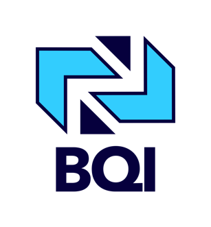

<p align="center">
  
</p>

<div align="center">

# BQI Tech Platform

<strong>Modern hiring, content, and operations stack for BQI Tech</strong>

<br/>

<a href="https://nextjs.org"></a>
<a href="https://www.typescriptlang.org/"></a>
<a href="https://tailwindcss.com/"></a>
<a href="https://ui.shadcn.com/"></a>
<a href="https://fastapi.tiangolo.com/"></a>
<a href="https://www.mongodb.com/"></a>
<a></a>

</div>

A modern full‑stack application consisting of:
- Next.js 14 App Router frontend (TypeScript, Tailwind, shadcn/ui, Radix UI)
- FastAPI backend with MongoDB
- Auth, admin dashboard, jobs and applications, blog, uploads, and notifications

### Monorepo layout

```
.
├─ app/                      # Next.js app router routes
├─ components/               # Shared React components (shadcn/ui)
├─ lib/                      # Frontend libs (API clients, utils)
├─ contexts/                 # React contexts (auth, settings, admin theme)
├─ hooks/                    # Reusable React hooks
├─ Backend/                  # FastAPI service
│  ├─ app/routers/           # API routers (admin, jobs, applications, blog, etc.)
│  ├─ app/models/            # Pydantic/DB models
│  ├─ app/lib/               # Integrations (email, dropbox, etc.)
│  └─ app/main.py            # FastAPI app entry
└─ public/                   # Static assets
```

### Prerequisites

- Node.js 18+ and pnpm/npm
- Python 3.11+
- MongoDB (Atlas or local) connection string

### Environment

Create `.env` in project root and `Backend/.env` for the API.

Frontend `.env` example:

```
NEXT_PUBLIC_PYTHON_API_URL=http://localhost:9000
NEXT_PUBLIC_APP_URL=http://localhost:3000
```

Backend `Backend/.env` example:

```
MONGODB_URI=mongodb+srv://<user>:<pass>@cluster/dbname
JWT_SECRET=<random-64-bytes>
ALLOWED_ORIGINS=http://localhost:3000

# Optional — Settings → Integrations → Microsoft calendar sync
MICROSOFT_CLIENT_ID=
MICROSOFT_CLIENT_SECRET=
MICROSOFT_TENANT_ID=organizations
MICROSOFT_REDIRECT_URI=http://localhost:9000/api/admin/integrations/microsoft/callback
```

After adding Microsoft env vars, **restart the backend** so new routes and credentials load.

### Run locally

Terminal 1 – FastAPI:

```bash
cd Backend
python -m uvicorn app.main:app --host 0.0.0.0 --port 9000 --reload
```

Terminal 2 – Next.js:

```bash
pnpm dev
# or npm run dev
```

Frontend: `http://localhost:3000`
Backend: `http://localhost:9000/api`

### Progressive Web App (PWA)

Production builds register a service worker via `@ducanh2912/next-pwa` (disabled in `next dev`).

- **Install:** open the production app in Chrome/Edge → address-bar install icon, or DevTools → Application → Manifest → Install.
- **Verify:** Application → Manifest / Service Workers; Lighthouse → Progressive Web App. Offline fallback: `/offline`.
- Icons live under `public/icons/`; manifest is generated from `app/manifest.ts`.

### Key features

- Admin dashboard: manage users, jobs, questions, applications, notifications
- Public site: careers, blog, services, contact
- Applications: multi‑step dynamic questions, file upload, validation
- Scoped admin theming: dashboard dark mode does not affect public pages
- Health indicator: live backend status in admin header

### API quick reference

Public:
- `GET /api/jobs` – list jobs
- `GET /api/jobs/{id}` – job detail
- `GET /api/jobs/{id}/questions` – job questions
- `POST /api/applications` – submit application (auth required)

Admin (auth required):
- `GET /api/admin/job-postings` – list jobs
- `POST /api/admin/job-postings` – create
- `PUT /api/admin/job-postings/{id}` – update
- `DELETE /api/admin/job-postings/{id}` – delete
- `GET /api/admin/applications/{id}` – get application
- `PUT /api/admin/applications/{id}` – update
- `DELETE /api/admin/applications/{id}` – delete
- `GET /api/admin/users` – list users

### Scripts

See `Backend/scripts/` and `scripts/` for maintenance and migration helpers.

### Testing

Basic endpoint tests live in `scripts/` (e.g. `scripts/test_endpoints.py`) and under `Backend/`.

### Deployment

- Frontend: Vercel or any Node host
- Backend: Render.com (files provided: `Backend/render.yaml`, `Backend/RENDER_DEPLOYMENT.md`)

### Development tips

- Keep `NEXT_PUBLIC_PYTHON_API_URL` in sync with your FastAPI port
- Ensure MongoDB is reachable before starting the backend
- If uploads fail with 401, refresh the session and retry

### License

MIT
